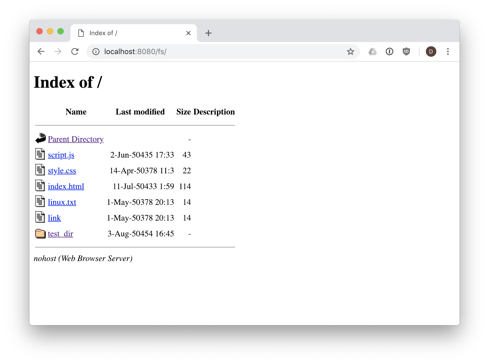

A web server in your web browser.

This uses [Filer](https://github.com/filerjs/filer) to run a node'js style
POSIX filesystem inside a Service Worker, and handle requests for static files and
directories.

The most likely use case for it would be an app that uses Filer to run a filesystem
in the window, and then using nohost to provide a way to interact with the filesystem
in the browser like you would with Apache or another web server hosting static files.

To run it:

```
npm install
npm run dev
```

Open `http://localhost:8080/`, which will install the Service Worker.  You can
then browse into the filesystem via `http://localhost:8080/fs/*`, where `/*` is
a path into the filesystem.

To get metadata about files/directories vs. contents, add `?json` to the URL.
For example: `http://localhost:8080/fs/dir?json`

To download instead of view files in the browser, add `?download` or `?dl` to the URL.
For example: `http://localhost:8080/fs/path/to/file.png?dl`

NOTE: I don't currently have a demo up, so the default filesystem is empty.  My plan
is to rework this into a module you can include along with Filer to allow
self-hosting of static files in the browser.  Here's what it looks like running
with a fileystem manually created:


